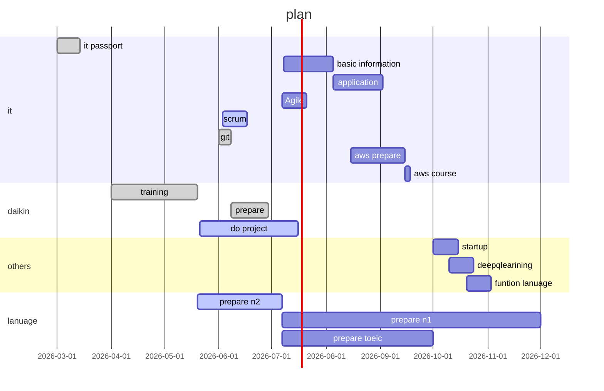

```mermaid
gantt
       dateFormat  MM-DD
       title plan

       section it
       it passport           :done,    des1,    03-01,03-14
       basic information     :         des2,     07-08, 4w
       application           :         des3,after des2, 4w
       Agile                 :         des5,     07-07, 2w
       scrum                 :active,  des6,     06-03, 2w
       git                   :done,   des20,     06-01, 1w
       aws  prepare          :         des8,   08-15, 09-15
       aws course            :         des9,     09-15, 3d

       section daikin
       training              :done,      des4, 04-01,05-20
       prepare               :done,   des10,after des20, 3w
       do project            :active,   des11, 05-21,    8w

       section others
       startup               :          des15,10-01,    2w
	     deepqlearining        :                10-10,    2w
	     funtion lanuage       :                10-20,    2w


       section lanuage
       prepare n2            :active,  des7,after des4,07-07
       prepare n1            :              after des7,12-01
       prepare toeic         :              after des7,10-01
```

- rank：
>  1 git
>  2 web: front-end framework,nosql,cl/cd
>   2 network
>>   2 linux
>>   2 oo
>>   0 development agile,scrum
>>   3 cloud
>>   10 lean startup
